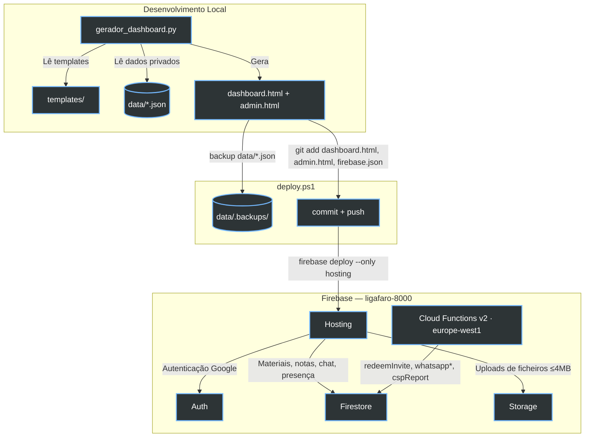

```
██╗███████╗███████╗██████╗     ██╗  ██╗ █████╗  ██████╗██╗  ██╗███████╗██████╗ ███████╗
██║██╔════╝██╔════╝██╔══██╗    ██║  ██║██╔══██╗██╔════╝██║ ██╔╝██╔════╝██╔══██╗██╔════╝
██║█████╗  █████╗  ██████╔╝    ███████║███████║██║     █████╔╝ █████╗  ██████╔╝███████╗
██║██╔══╝  ██╔══╝  ██╔═══╝     ██╔══██║██╔══██║██║     ██╔═██╗ ██╔══╝  ██╔══██╗╚════██║
██║███████╗██║     ██║         ██║  ██║██║  ██║╚██████╗██║  ██╗███████╗██║  ██║███████║
╚═╝╚══════╝╚═╝     ╚═╝         ╚═╝  ╚═╝╚═╝  ╚═╝ ╚═════╝╚═╝  ╚═╝╚══════╝╚═╝  ╚═╝╚══════╝
```

# CET Cibersegurança Dashboard — IEFP Faro

<div align="center">
  
  
  
  
  <br>
  <em>Portal centralizado de acompanhamento, estudo e produtividade para o CET em Cibersegurança do IEFP Faro.</em>
</div>

<br>

**URL de Produção:** [https://iefp-hackers.web.app](https://iefp-hackers.web.app)
**Projeto Firebase:** `ligafaro-8000` · **Site Hosting:** `iefp-hackers` · **Região Functions:** `europe-west1`

---

## Índice

- [Visão Geral](#visão-geral)
- [Arquitetura](#arquitetura)
- [Funcionalidades](#funcionalidades)
- [Estrutura do Projeto](#estrutura-do-projeto)
- [Como Gerar e Fazer Deploy](#como-gerar-e-fazer-deploy)
- [Dados (`data/*.json`)](#dados-datajson)
- [Backend Firebase](#backend-firebase)
- [Segurança](#segurança)
- [Backend legado (`api/`)](#backend-legado-api)
- [Pré-requisitos e Configuração](#pré-requisitos-e-configuração)

---

## Visão Geral

Dashboard interativo para o Curso de Especialização Tecnológica (CET) em Cibersegurança. Agrega horários mensais, programa das UCs, materiais de aulas, chat de turma, notas pessoais e laboratórios de código executados diretamente no browser — sem necessidade de servidor de aplicação.

O script `gerador_dashboard.py` lê os templates (`templates/`) e os dados (`data/*.json`) e compila `dashboard.html`/`admin.html` — ficheiros **completamente auto-contidos**, com todo o CSS e JS inline, sem dependências externas em runtime além dos SDKs carregados via CDN (Firebase, CodeMirror, Pyodide, jsPDF, KaTeX, marked).

---

## Arquitetura



Todo o estado dinâmico (materiais de sessão, notas pessoais, chat, presença online, convites) vai direto para **Firestore**. Existe um backend Cloud Run/FastAPI+PostgreSQL legado em `api/`, mantido no repositório mas não confirmado como ativo em produção — ver [Backend legado](#backend-legado-api).

---

## Funcionalidades

### Horário e Disciplinas
- Vista mensal e semanal com cartões dinâmicos (slots de 1h consecutivos da mesma UC fundidos automaticamente)
- Badge 🌐 para UCs sempre remotas (`modalidade: "remoto"` em `data/ucs_*.json`) e para datas pontuais remotas (`REMOTE_DATE_EXCEPTIONS`)
- Exportação para PDF (listagem e vista semanal) via `jsPDF` + `jspdf-autotable`
- Catálogo de UCs pesquisável, com formadores, carga horária e horário detalhado por UC, organizado em três estados: **Em curso / Por agendar / Concluídas**

### Área de UC e Materiais
- Materiais partilhados por sessão (PDF, YouTube/vídeo, ZIP, Office, imagens) armazenados no Firebase Storage, indexados no Firestore
- Chat inline por UC e chat global de turma (Firestore, tempo real)
- Notas pessoais com Markdown, LaTeX (KaTeX) e colar imagem, auto-save e sincronização Firestore por utilizador

### Turma e Presença
- Chips de presença mostram apenas utilizadores **online** (heartbeat a cada 2 min, `lastSeen` < 5 min)
- Grupo WhatsApp da turma sincronizado com o chat via Cloud Functions (Green API)

### Aulas Remotas
- Secção dedicada com atalhos diretos: Google Classroom e links Microsoft Teams por formador/UC/sessão (`REMOTE_CLASS_LINKS` em `templates/js/links.js`)

### Playground Integrado
Ambientes sandbox com CodeMirror 5.65.16 (tema Dracula), executados inteiramente no browser:
- **Python:** [Pyodide v0.26.4](https://pyodide.org/) (CPython em WASM) a correr num Web Worker (`pyodide-worker.js`), com `micropip`, multi-ficheiro e dezenas de exemplos embutidos (básico, cibersegurança)
- **SQL:** [sql.js 1.10.3](https://sql.js.org/) (`sql-asm.js`), DDL/DML de demonstração pré-populados

### Cheatsheets e Referência
- `cheatsheet_python.html`, `cheatsheet_cybersec.html`, `cheatsheet_sql_cybersec.html` — páginas de referência standalone
- `redes/*.html` — referência de Redes (TCP/IP, OSI, UDP, IP, topologias, switch/VLAN/router), acessível via submenu na sidebar
- `CyberMap.html` — mapa/visualização de conceitos de cibersegurança

### Administração
- Painel `/admin.html` (rewrite de `admin.html`), restrito a utilizadores com custom claim `admin`
- Roles: `aluno`, `moderador`, `admin` — geridos via custom claims Firebase e atribuídos com `seed_admin.py`
- Moderador: acesso de leitura ao admin, pode gerir convites e alterar roles com permissões limitadas (nunca a própria nem para `admin`)
- Sistema de convites (`invites` no Firestore) para registo controlado de novos alunos, resgatados via Cloud Function `redeemInvite`

---

## Estrutura do Projeto

```
IEFP_Hackers/
├── gerador_dashboard.py          # Gerador principal — lê templates + data/*.json, escreve dashboard.html/admin.html
├── deploy.ps1                    # Deploy seguro: backup data/, gera, commit+push só de ficheiros gerados, firebase deploy
├── seed_admin.py                 # CLI para atribuir roles Firebase (custom claims)
├── gerar_pdf_junho.py            # Script utilitário para gerar PDF de horário
├── pyodide-worker.js             # Web Worker do playground Python (carrega Pyodide v0.26.4)
│
├── dashboard.html                # Output gerado — NÃO EDITAR MANUALMENTE
├── admin.html                    # Output gerado — NÃO EDITAR MANUALMENTE
│
├── firebase.json                 # Hosting (rewrites, headers CSP, cache), Functions, Firestore, Storage config
├── firestore.rules               # Regras de acesso Firestore (roles, ownership por UID)
├── firestore.indexes.json        # Índices compostos Firestore
├── storage.rules                 # Limites de upload (4 MB, MIME types) por utilizador
├── .firebaserc                   # Projeto Firebase por omissão (ligafaro-8000)
│
├── templates/
│   ├── dashboard.html            # Esqueleto HTML (estrutura, sem CSS/JS inline; contém os marcadores __INJECT_*__)
│   ├── css/                      # Concatenado por ordem fixa (ver gerador_dashboard.py)
│   │   ├── variables.css         # Variáveis :root e reset base
│   │   ├── layout.css            # Header, sidebar, layout principal
│   │   ├── components.css        # Horário, disciplinas, UC, PDF, progresso, auth
│   │   ├── theme.css             # Animações, responsive, tema claro
│   │   ├── playground.css        # Editor do playground
│   │   ├── nav-sidebar.css       # Sidebar de navegação
│   │   ├── views.css             # Estilos por vista, breakpoints tablet/mobile, chat
│   │   └── lab.css               # Estilos da secção "Lab"
│   └── js/                       # Concatenado por ordem fixa — módulos partilham globals, não são ES modules
│       ├── data.js               # Marcadores __INJECT_*__ (dados embutidos no build)
│       ├── firebase.js           # Init Firebase (db, auth, storage)
│       ├── utils.js              # Helpers: escapeHtml, shortName, calcSessionHours, …
│       ├── state.js              # Estado global e refs DOM
│       ├── views.js              # switchView(), navegação mobile
│       ├── horario.js            # mergeTimeSlots, renderCronograma, renderHorario, deteção de aulas remotas
│       ├── disciplinas.js        # renderDisciplines, detalhe UC, horário por UC
│       ├── materials.js          # Materiais de sessão (Firestore + Storage)
│       ├── turma.js              # renderTurma, presença/heartbeat
│       ├── chat.js               # Chat global + chat inline por UC
│       ├── auth.js               # Auth Firebase (Google sign-in)
│       ├── dashboard.js          # Vista dashboard, hoje/amanhã, progresso, relógio
│       ├── playground.js         # Pyodide/SQLite via Web Worker, CodeMirror, gestão de ficheiros
│       ├── pdf.js                # Geração PDF (listagem, semanal, detalhe UC)
│       ├── convites.js           # Gestão de convites (criação, revogação, resgate)
│       ├── definicoes.js         # Vista de definições
│       ├── lab.js                # Secção "Lab"
│       ├── cheatsheets.js        # Integração com as páginas de cheatsheet
│       ├── redes.js              # Submenu/integração das páginas de Redes
│       ├── links.js              # USEFUL_LINKS, REMOTE_CLASS_LINKS (Teams/Classroom)
│       └── init.js               # Bootstrap DOMContentLoaded, captura de token de convite
│
├── data/                         # PRIVADO — git-ignorado, não incluído no checkout
│   ├── horario_<mes>_<ano>.json  # Um ficheiro por mês; TODOS são carregados (glob)
│   ├── ucs_*.json                # Só o mais recente é lido; UCs, formadores, modalidade
│   ├── cronograma_*.json         # Só o mais recente é lido; período, carga horária total
│   └── .backups/                 # Backups automáticos criados por deploy.ps1 (git-ignorado)
│
├── functions/                    # Cloud Functions v2 (Node 20, região europe-west1)
│   └── index.js                  # redeemInvite, whatsappWebhook, whatsappSend, whatsappListGroups, cspReport
│
├── api/                          # Backend legado FastAPI + PostgreSQL (ver secção dedicada)
├── db/schema.sql                 # Schema PostgreSQL do backend legado
├── docs/                         # PDFs/imagens de referência do curso (horários, cronograma)
│
├── redes/                        # Páginas HTML standalone de referência de Redes
├── cheatsheet_*.html             # Páginas HTML standalone de cheatsheets
├── CyberMap.html / CyberMap (beta).html
│
├── DEPLOY.md                     # Fluxo manual detalhado (git, firebase, gcloud) — ver também deploy.ps1
└── CLAUDE.md                     # Notas de arquitetura para agentes de IA (Claude Code)
```

---

## Como Gerar e Fazer Deploy

### Pré-requisitos
- Python 3.9+
- Firebase CLI: `npm install -g firebase-tools && firebase login`
- PowerShell (Windows) para `deploy.ps1`
- Ficheiros `data/*.json` presentes localmente (git-ignorados — pedir ao responsável do curso se não existirem)

### Fluxo recomendado — `deploy.ps1`

```powershell
# Gera dashboard.html/admin.html, faz backup de data/, commit + push + firebase deploy
.\deploy.ps1 -Message "descrição da alteração"

# Só commit local, sem push nem deploy
.\deploy.ps1 -Message "descrição" -SkipPush -SkipDeploy

# Commit + push, sem publicar no Firebase
.\deploy.ps1 -Message "descrição" -SkipDeploy
```

O script:
1. Copia todos os `data/*.json` para `data/.backups/<timestamp>/` antes de qualquer alteração
2. Corre `python gerador_dashboard.py`
3. Faz `git add` **apenas** a `dashboard.html`, `admin.html`, `firebase.json` (nunca `git add -A`/`.`, para nunca arriscar apanhar ficheiros de `data/`)
4. Aborta e reverte o staging se detetar qualquer ficheiro de `data/` staged
5. Comita, dá push e corre `firebase deploy --only hosting --project ligafaro-8000`

### Fluxo manual (equivalente, passo a passo)

```bash
# Gerar
python gerador_dashboard.py

# Deploy — hosting apenas
firebase deploy --only hosting --project ligafaro-8000

# Deploy — Cloud Functions
firebase deploy --only functions --project ligafaro-8000

# Deploy — regras Firestore/Storage
firebase deploy --only firestore,storage --project ligafaro-8000

# Deploy completo
firebase deploy --project ligafaro-8000
```

Ver `DEPLOY.md` para o fluxo git manual completo e configuração de credenciais `gcloud`/service account.

### Adicionar um novo mês de horário

1. Criar `data/horario_<mes>_<ano>.json` seguindo o schema existente (ver [Dados](#dados-datajson))
2. Correr `.\deploy.ps1 -Message "feat: adicionar horário de <mês>"`
3. O novo mês aparece automaticamente — o gerador carrega **todos** os `data/horario_*.json` presentes

### Editar CSS ou JS

Editar os ficheiros em `templates/css/` ou `templates/js/`, depois re-gerar (`deploy.ps1` ou `python gerador_dashboard.py`). **Nunca editar `dashboard.html`/`admin.html` diretamente** — são sobrescritos a cada geração.

### Atribuir roles

```bash
python seed_admin.py --email utilizador@gmail.com --role admin
# roles disponíveis: aluno, moderador, admin
```

---

## Dados (`data/*.json`)

Estes ficheiros são **privados e git-ignorados** — não fazem parte do checkout público e devem ser pedidos/preservados localmente com cuidado (não há histórico git para os recuperar se forem apagados).

### `data/horario_<mes>_<ano>.json`

Um ficheiro por mês; **todos** os ficheiros que casem com `data/horario_*.json` são carregados e concatenados pelo gerador.

```json
{
  "horario": {
    "mes_ano": "agosto 2026",
    "dias": [
      {
        "data": "2026-08-24",
        "dia_semana": "SEG",
        "aulas": [
          { "hora": "09:00-10:00", "uc": "UC00598", "descricao": "...", "formador": "..." }
        ],
        "nota": "Feriado — ..."
      }
    ]
  }
}
```

### `data/ucs_*.json`

Apenas o ficheiro mais recente é lido (por nome/ordem alfabética).

```json
{
  "unidades_formacao_curta_duracao": [
    {
      "codigo": "UC00616",
      "descricao": "Implementar as Normas de Segurança e Saúde no Trabalho no Setor de Informática",
      "formador": "Nome do Formador",
      "carga_horaria": 50,
      "modalidade": "remoto"
    }
  ]
}
```

`modalidade: "remoto"` marca a UC como **sempre remota** (badge 🌐 em todas as sessões dessa UC, independentemente da data).

### `data/cronograma_*.json`

Apenas o ficheiro mais recente é lido — período do curso, carga horária total, resumo mensal.

---

## Backend Firebase

**Projeto:** `ligafaro-8000` · **Hosting site:** `iefp-hackers`

### Cloud Functions v2 (`functions/index.js`, Node 20, `europe-west1`)

| Função | Tipo | Descrição |
|---|---|---|
| `redeemInvite` | `onCall` | Resgate de convites via transação Firestore atómica; único caminho que pode atribuir `role` a um utilizador |
| `whatsappWebhook` | `onRequest` | Recebe mensagens do grupo WhatsApp (Green API) e sincroniza com o chat Firestore |
| `whatsappSend` | `onCall` | Envia mensagens do chat da app para o grupo WhatsApp |
| `whatsappListGroups` | `onRequest` | Lista grupos WhatsApp disponíveis (Green API) |
| `cspReport` | `onRequest` | Endpoint de relatório de violações CSP (`report-uri`) |

### Firestore — coleções principais

- `users/{uid}` — perfil e `role` (`blocked` por omissão; só a Cloud Function ou um admin podem promover)
- `invites/{token}` — convites com `expiresAt`, `active`, `uses`; criação/revogação restrita a `moderador`/`admin`
- `notes/{uid}_{sessionKey}` — notas pessoais, só acessíveis ao próprio dono (e leitura por moderador)
- `materials/{sessionKey}` — materiais partilhados por sessão (`ucCode` ou `ucCode_date`)
- Presença, chat e demais estado dinâmico seguem o mesmo padrão de acesso por role/ownership

### Hosting

- `public: "."` com `ignore` extenso — só `dashboard.html`, `admin.html`, assets estáticos, `redes/`, `cheatsheet_*.html`, `CyberMap*.html` são publicados; `data/`, `docs/`, `api/`, `db/`, `*.py`, `*.md` ficam de fora
- Rewrites: `/` → `dashboard.html`, `/admin` → `admin.html`
- `Cache-Control: no-cache, no-store, must-revalidate` em todo o HTML (evita servir builds antigos)
- CSP, HSTS, `X-Frame-Options`, `X-Content-Type-Options`, `Permissions-Policy` aplicados globalmente; CSPs mais restritivas por página em `admin.html`, `cheatsheet_*.html`, `CyberMap.html`, `redes/**`

---

## Segurança

1. **Autenticação:** Google OAuth via Firebase Auth — sem fallback de password
2. **Autorização:** custom claims (`aluno`/`moderador`/`admin`), aplicadas tanto no cliente como nas Firestore/Storage rules; `role` só pode ser atribuído server-side (`redeemInvite` ou admin)
3. **CSP:** `script-src` com hash `sha384-` do bloco inline (recalculado automaticamente por pre-commit hook a cada alteração de `dashboard.html`) + allowlist explícita de origens (cdnjs, jsdelivr, Google, Microsoft para SSO); `frame-ancestors` restrito; `object-src 'none'`
4. **Firestore Rules:** acesso por UID e por `role`; notas pessoais inacessíveis a outros alunos; convites não listáveis por alunos (evita enumeração de tokens)
5. **Storage Rules:** limite de 4 MB por upload, escrita restrita ao próprio diretório do utilizador (`uc-files/{uid}/`), MIME types explicitamente permitidos (PDF, Office, texto, imagens, ZIP)
6. **Headers de segurança:** HSTS com `preload`, `X-Frame-Options: SAMEORIGIN`, `X-Content-Type-Options: nosniff`, `Permissions-Policy` a bloquear câmara/microfone/geolocalização

Qualquer novo domínio externo (CDN, API) usado em `templates/js/` ou `templates/css/` tem de ser adicionado às diretivas CSP em `firebase.json`, ou a funcionalidade quebra silenciosamente em produção.

---

## Backend legado (`api/`)

`api/` contém um backend FastAPI + PostgreSQL (Cloud Run), com `Dockerfile`, `auth.py`, `main.py` e dependências (`fastapi`, `uvicorn`, `asyncpg`, `firebase-admin`, `slowapi`). Todo o estado dinâmico da aplicação foi desde então migrado para Firestore. **Confirmar com o responsável do projeto antes de assumir que este backend está ativo em produção** — pode ser código morto mantido por referência histórica.

---

## Pré-requisitos e Configuração

- **Python 3.9+** — para `gerador_dashboard.py`, `seed_admin.py`
- **Node.js 20** — para `functions/` (Cloud Functions v2)
- **Firebase CLI** (`npm install -g firebase-tools`) autenticado (`firebase login`) com acesso ao projeto `ligafaro-8000`
- **Google Cloud SDK** (`gcloud`) — para operações administrativas e logs de Functions (ver `DEPLOY.md`)
- Não há test suite nem linter configurados neste repositório

---

*Financiamento: Algarve 2030 · Portugal 2030 · União Europeia*
*Formação modular em contexto — IEFP Faro*
