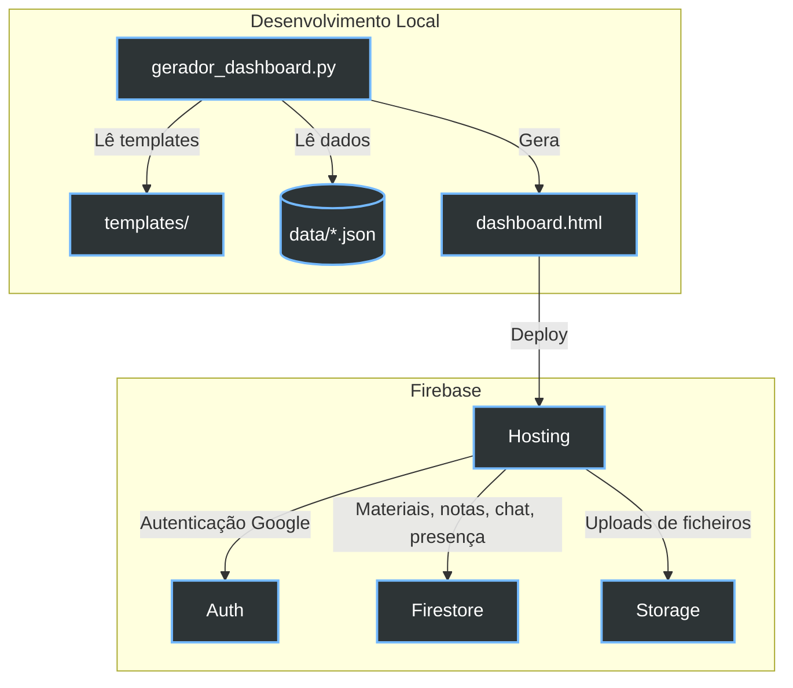

```
██╗███████╗███████╗██████╗     ██╗  ██╗ █████╗  ██████╗██╗  ██╗███████╗██████╗ ███████╗
██║██╔════╝██╔════╝██╔══██╗    ██║  ██║██╔══██╗██╔════╝██║ ██╔╝██╔════╝██╔══██╗██╔════╝
██║█████╗  █████╗  ██████╔╝    ███████║███████║██║     █████╔╝ █████╗  ██████╔╝███████╗
██║██╔══╝  ██╔══╝  ██╔═══╝     ██╔══██║██╔══██║██║     ██╔═██╗ ██╔══╝  ██╔══██╗╚════██║
██║███████╗██║     ██║         ██║  ██║██║  ██║╚██████╗██║  ██╗███████╗██║  ██║███████║
╚═╝╚══════╝╚═╝     ╚═╝         ╚═╝  ╚═╝╚═╝  ╚═╝ ╚═════╝╚═╝  ╚═╝╚══════╝╚═╝  ╚═╝╚══════╝
```

# CET Cibersegurança Dashboard — IEFP Faro

<div align="center">
  
  
  
  <br>
  <em>Portal centralizado de acompanhamento, estudo e produtividade para o CET em Cibersegurança do IEFP Faro.</em>
</div>

<br>

**URL de Produção:** [https://iefp-hackers.web.app](https://iefp-hackers.web.app)

---

## Visão Geral

Dashboard interativo para o Curso de Especialização Tecnológica (CET) em Cibersegurança. Agrega horários mensais, programa das UCs, materiais de aulas, chat de turma, notas pessoais e laboratórios de código executados diretamente no browser.

O script `gerador_dashboard.py` lê os dados JSON e compila um `dashboard.html` completamente auto-contido — sem dependências externas em runtime, sem servidor necessário para abrir.

---

## Arquitetura



Todo o estado dinâmico (materiais de sessão, notas pessoais, chat, presença online) vai direto para **Firestore** — o backend Cloud Run/PostgreSQL foi removido.

---

## Funcionalidades

### Horário e Disciplinas
- Vista mensal e semanal com cartões dinâmicos (slots de 1h fundidos automaticamente)
- Badges para UCs remotas (UC00602) e FPCT
- Exportação para PDF (listagem e vista semanal) via `jsPDF`
- **26 UCs** organizadas em três estados: **Em curso / Por agendar / Concluídas**
- Catálogo pesquisável com formadores, carga horária e horário detalhado por UC

### Área de UC e Materiais
- Materiais partilhados por sessão (PDF, YouTube/vídeo, ZIP) armazenados em Firestore
- Chat inline por UC e chat global de turma
- Notas pessoais com auto-save e sincronização Firestore

### Turma e Presença
- Chips de presença mostram apenas utilizadores **online** (lastSeen < 5 min)
- Heartbeat de presença a cada 2 minutos

### Playground Integrado
Ambientes sandbox com CodeMirror 5 (tema Dracula):
- **Python (Pyodide):** CPython em WASM, `micropip`, multi-ficheiro, dezenas de exemplos embutidos
- **SQL (SQLite):** `sql-asm.js`, DDL/DML de demonstração pré-populados

### Administração
- Painel `/admin.html` restrito a utilizadores com claim `admin`
- Roles: `aluno`, `moderador`, `admin` — geridos via `seed_admin.py`
- Moderador: acesso de leitura ao admin + pode alterar roles (limitado)

---

## Estrutura do Projeto

```
CyberSec/
├── gerador_dashboard.py          # Gerador principal — lê templates + JSON, escreve dashboard.html
├── seed_admin.py                 # CLI para atribuir roles Firebase
├── dashboard.html                # Output gerado — NÃO EDITAR MANUALMENTE
├── admin.html                    # Output gerado — NÃO EDITAR MANUALMENTE
├── firebase.json                 # Headers CSP, cache, routing
├── firestore.rules               # Regras de acesso Firestore
├── storage.rules                 # Limites de upload (4 MB, MIME types)
│
├── templates/
│   ├── dashboard.html            # Esqueleto HTML (estrutura, sem CSS/JS inline)
│   ├── css/
│   │   ├── variables.css         # Variáveis :root e reset base
│   │   ├── layout.css            # Header, sidebar, layout principal
│   │   ├── components.css        # Horário, disciplinas, UC, PDF, progresso, auth
│   │   ├── theme.css             # Animações, responsive, mobile, light theme, semana
│   │   ├── playground.css        # Editor playground
│   │   ├── nav-sidebar.css       # Nova sidebar de navegação
│   │   └── views.css             # Estilos por vista, breakpoints tablet/mobile, chat
│   └── js/
│       ├── data.js               # Marcadores __INJECT_*__ (dados embutidos no build)
│       ├── firebase.js           # Init Firebase (db, auth, storage)
│       ├── utils.js              # Helpers: escapeHtml, shortName, calcSessionHours, …
│       ├── state.js              # Estado global e refs DOM
│       ├── views.js              # switchView(), mobile sidebar/more menu
│       ├── horario.js            # mergeTimeSlots, renderCronograma, renderHorario
│       ├── disciplinas.js        # renderDisciplines, detalhe UC, horário UC
│       ├── materials.js          # Materiais de sessão (Firestore)
│       ├── turma.js              # renderTurma, presença/heartbeat
│       ├── chat.js               # Chat global + chat inline por UC
│       ├── auth.js               # Auth Firebase (Google sign-in)
│       ├── dashboard.js          # Vista dashboard, hoje/amanhã, progresso, relógio
│       ├── playground.js         # Pyodide/SQLite, CodeMirror, ficheiros
│       ├── pdf.js                # Geração PDF (listagem, semanal, detalhe UC)
│       ├── convites.js           # Gestão de convites
│       ├── definicoes.js         # Vista de definições
│       └── init.js               # DOMContentLoaded, captura de token de convite
│
└── data/
    ├── ucs_ciberseguranca.json
    ├── horario_abril_2026.json
    └── cronograma_cet_ciberseguranca_2.json
```

---

## Como Gerar e Fazer Deploy

### Pré-requisitos
- Python 3.9+
- Firebase CLI: `npm install -g firebase-tools && firebase login`

### Build + Deploy

```bash
# Gerar dashboard.html a partir dos templates e dados
python3 gerador_dashboard.py

# Deploy para Firebase Hosting
firebase deploy --only hosting --project ligafaro-8000
```

### Adicionar um novo mês de horário

1. Criar `data/horario_<mes>_<ano>.json` seguindo o schema existente
2. Correr `python3 gerador_dashboard.py`
3. O novo mês aparece automaticamente no dropdown

### Atribuir roles

```bash
python3 seed_admin.py --email utilizador@gmail.com --role admin
# roles disponíveis: aluno, moderador, admin
```

### Editar CSS ou JS

Editar os ficheiros em `templates/css/` ou `templates/js/`, depois re-gerar:

```bash
python3 gerador_dashboard.py
```

---

## Segurança

1. **Autenticação:** Google OAuth via Firebase Auth — sem fallback
2. **CSP:** Restrições estritas a `style-src`, `connect-src`; origens permitidas: `unpkg`, `cdnjs`, `jsdelivr`; `frame-ancestors DENY`
3. **Firestore Rules:** Acesso por UID — notas pessoais inacessíveis a outros utilizadores
4. **Storage Rules:** Limite 4 MB por upload, MIME types restritos (pdf, png, jpg, doc, zip)

---

*Financiamento: Algarve 2030 · Portugal 2030 · União Europeia*  
*Formação modular em contexto — IEFP Faro*
